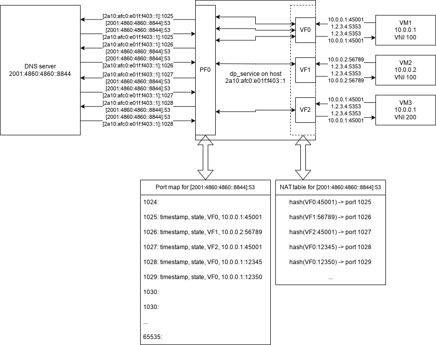

# Virtual services

Virtual service in the context of dp-service is the ability of VMs to reach an outside IPv6 service (e.g. a DNS service) using a (virtual) IPv4. This is transparent for the VM as it simply uses the virtual IPv4:port as normal. dp-service then provides a form of NAT for communication with the actual server.

Due to the NAT-nature, the amount of connections is limited to 64,512 for each defined virtual service (this number is shared by all VMs on the host). There is a timeout for NAT entries that frees up ports automatically. Established TCP connections have a timeout of 24 hours, all other connections only 30 seconds.

> Note that each defined virtual service manages its own pair of tables.

## TCP connection state
By default, NAT entries for connections wime out after 30 seconds of inactivity. This is not usable for TCP connections, thus after a successful *three-way handshake* the connection is considered established and the timeout increases to 24 hours.

After **either side** sends a RST packet or a FIN packet, the connection is no longer considered established by dp-service (thus the timeout is lowered back to the default value).
> This happens *immediately* after the first FIN packet is received, as opposed to the proper TCP connection termination procedure.

## Port assignment
dp-service assigns mapped ports incrementally in the effort to minimize collisions, thus only after the whole pool is exhausted, actual connection timeout is considered and older port numbers are reused. This algorithm is similar to the basic implementaion of ephemeral port assignment in [RFC 6056](https://www.rfc-editor.org/rfc/rfc6056).

## Memory requirements
Both port-mapping table and connection hash-table are pre-allocated up to the maximum number of open ports (i.e. 64512), resulting in around 2 MiB of space needed for each and every virtual service.
