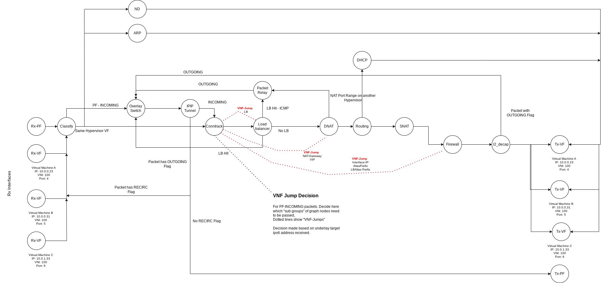

# Design
The Dataplane Service is built upon the DPDK library. At the heart of the functionality, there is the  [Graph Architecture](http://doc.dpdk.org/guides/prog_guide/graph_lib.html) for data processing. The dataplane based on the graph architecture looks like the following:

