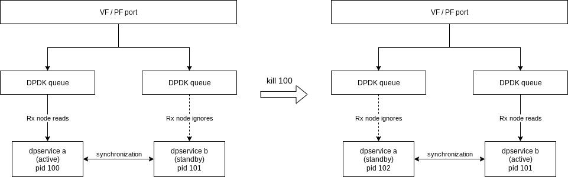

# Dpservice high-availability
Dpservice can be deployed in such a way, where killing/crashing dpservice process does not interrupt the flow of packets (or rather, the interruption is absolutely minimal).

## Active-standby
Dpservice is acting in a active/standby mode, similar to `ceph-mgr` for example. Once the active one is gone, the standby process is promoted to active and any newly created process is automatically in standby mode.

This is achieved by an exclusive file-lock on shared file, specified by `--active-lockfile`. This is guaranteed to be atomic by the kernel, no polling is needed and reaction time is almost instantaneous.

## Orchestration
For packet flow to not be interruped, it is essential for both dpservice processes to use the same underlay addresses. Without this, the new active dpservice would of course drop current packet flows as they would not be addressed to the right VNF.

This needs a change in [metalnet](https://github.com/ironcore-dev/metalnet) orchestration. Either it needs to connect to both dpservice instances and handle the situation when a process goes down, or it must exist in two instances, each orchestrating a separate dpservice process.

For this to work, dpservice accepts externally generated underlay addresses as a part of gRPC protocol. This way the address can be generated by metalnet and then simply sent to both instances. See the [example use page](example.md) for details.

## Internal state synchronization
While the above is enough for basic high-availability scenario, there are still situation where a packet flow would get interrupted. This is caused by the standby process not having MAC address information (thus forcing it to wait for ARP/ND/DHCP), and by not having NAT entries the active instance has. 

To implement proper high-availability without (almost) any flow interruption, some data needs to be synchronized between active and standby instances.

This is achieved via a dedicated bridge with a TAP interface assigned to each instance. This way the [graph loop](../sys_design/) can handle synchronization like any other traffic and not special thread or handler is needed.

Dpservice synchronizes NAT entries, Virtual service entries, MAC addresses of VFs, for details see the [implementation specifics](implementation_specifics.md).

The bridge and two TAP devices are handled by `prepare.sh` and thus by the `initContainer` of the `dp-service` pod.
