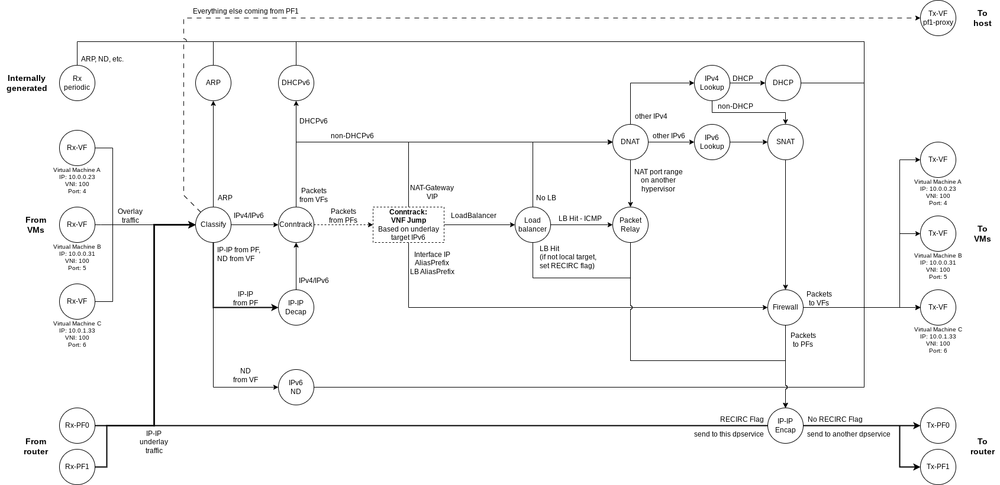
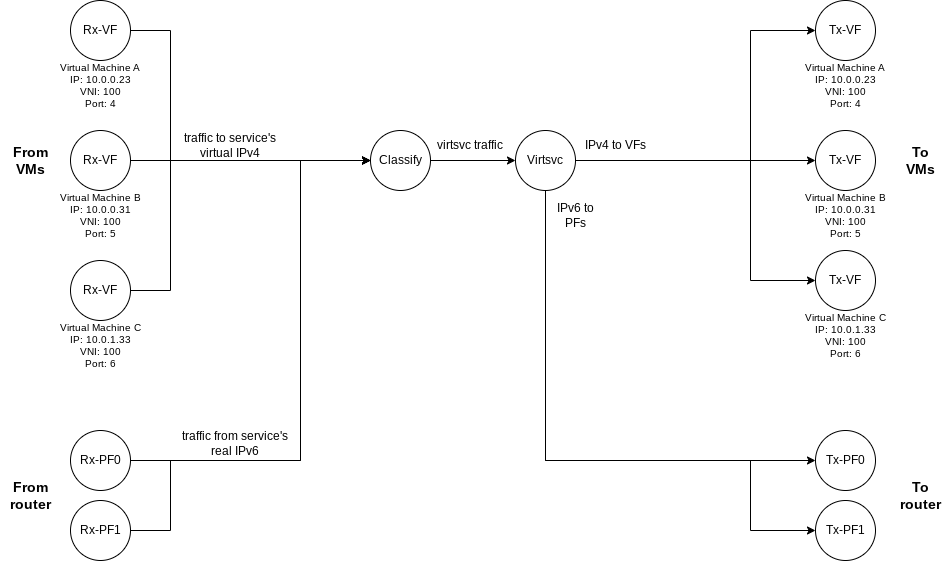

# Graph Framework
This is the graph topology for packets handled by dpservice. Offloaded packets never enter dpservice (and thus the graph) itself.

Note that every graph node actually has one other edge to it that leads to a **"Drop"** node, but for clarity this is omitted. As the name suggests, that node has no other edge and is simply dropping the packets without sending them anywhere.

## Virtual services
If virtual services are compiled-in, there is another path for packets to take. Packets going from a virtual IPv4 and TCP/UDP port to a specific web-service (i.e. specific IPv6 and TCP/UDP port) undergo an IP header replacement (from IPv4 to IPv6 and back) to enable VMs to contact IPv6 web-services without the use of NAT. This is useful for services that are heavily used by many connections, like DNS, k8s api-servers, etc.

For this to work some changes to the graph topology are needed. For simplicity, this schema is separate and should be imagined as an "overlay" over the standard schema above.

