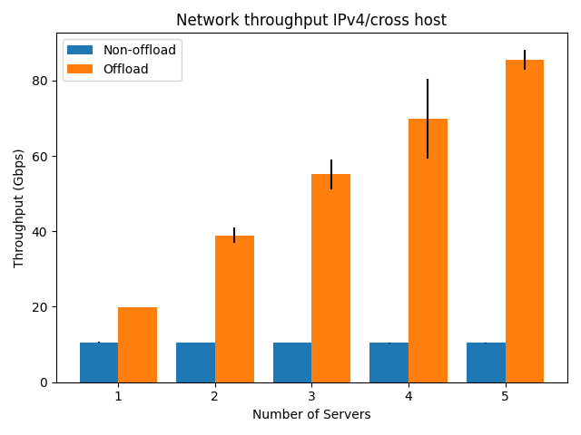

# Performance benchmarking
The performance benchmarking results are based on the iperf3 approach described in this [section](../performance_test.md). Please note that the results can vary depending on the used CPU and Mellanox cards. The benchmarking results presented here are measured on machines using Mellanox ConnectX-6 Dx cards, and the maximum segment size used by iperf3 is set to 1400 (`--payload-length 1400`).

## Result for IPv4 traffic between VMs on the same hypervisor

## Result for IPv4 traffic between VMs cross two hypervisors

## Result for IPv6 traffic between VMs on the same hypervisor

## Result for IPv6 traffic between VMs cross two hypervisors

